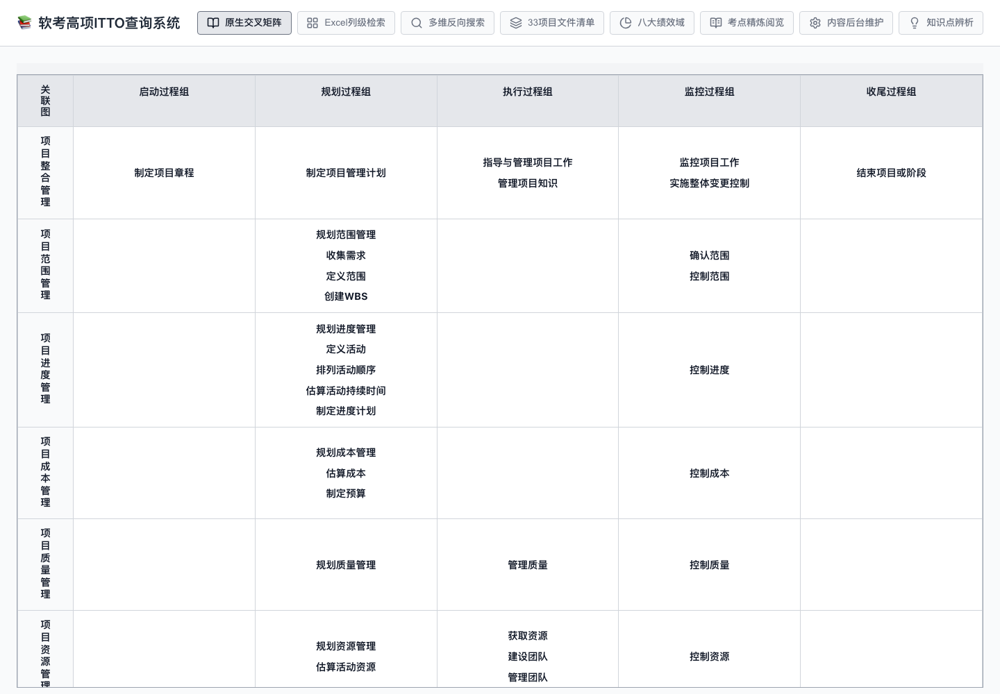
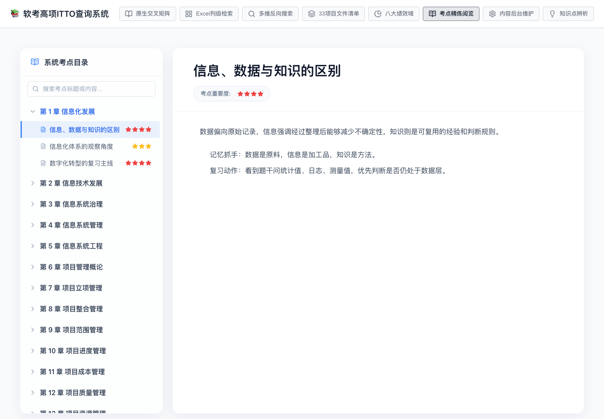
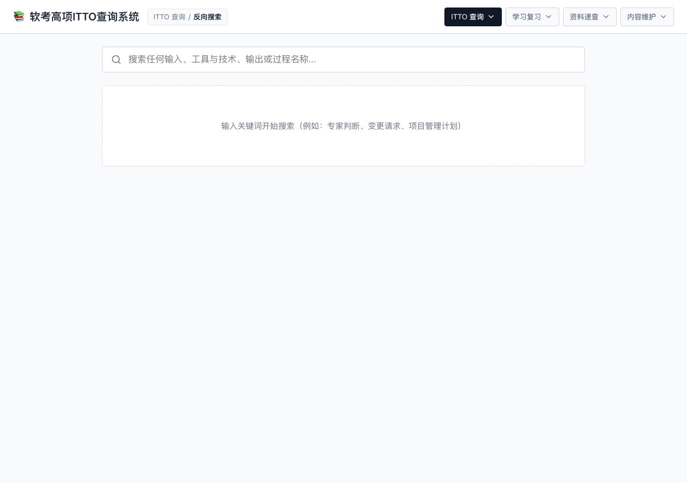
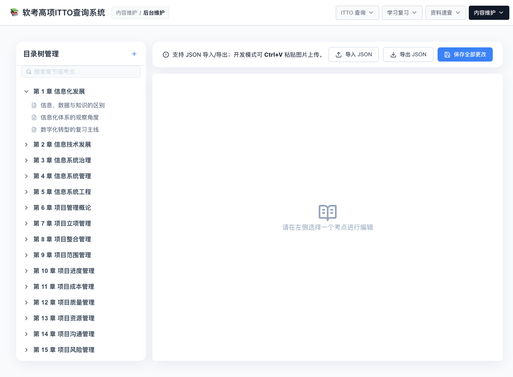

# 软考高项复习工具

一个本地优先的软考高级项目管理复习工具，提供 ITTO 矩阵查询、过程反向搜索、项目文件清单、八大绩效域、考点 Markdown 阅览和本地内容维护能力。

当前开源版内置的是精简原创示例数据：保留 24 章目录结构，每章 3 个考点，共 72 个考点；不包含官方教材、考试题库、第三方培训资料或来源不明确的截图素材。

## Demo

在线演示：

https://vosamy1982.github.io/ruankao-gaoxiang-tools/

也可以直达常用视图：

- [原生交叉矩阵](https://vosamy1982.github.io/ruankao-gaoxiang-tools/#mapping)
- [Excel 列级检索](https://vosamy1982.github.io/ruankao-gaoxiang-tools/#matrix)
- [多维反向搜索](https://vosamy1982.github.io/ruankao-gaoxiang-tools/#search)
- [考点精炼阅览](https://vosamy1982.github.io/ruankao-gaoxiang-tools/#examPoints)
- [内容后台维护](https://vosamy1982.github.io/ruankao-gaoxiang-tools/#admin)

## 界面预览

| ITTO 交叉矩阵 | 考点阅览 |
|---|---|
|  |  |

| 反向搜索 | 内容维护 |
|---|---|
|  |  |

## 功能

- 10 大知识域、5 大过程组、49 个过程的 ITTO 交叉矩阵
- 按输入、工具与技术、输出进行列级检索
- 按关键词反向搜索过程、输入、工具与技术、输出
- 33 个项目文件和项目管理计划组件速查
- 八大绩效域目标、检查方法和记忆口诀
- Markdown 考点阅览，支持表格、图片路径和 GFM
- 考点收藏、学习状态、进度统计和状态筛选
- 智能复习队列，支持继续学习、前后切换和随机抽取
- 学习记录本地持久化，支持独立导入、导出和清空
- 浏览器内导入、校验、编辑和导出私有考点 JSON
- 开发模式下保存源码数据与粘贴图片上传
- 自动检查数据结构、图片资源和内容合规风险
- 按视图加载前端代码，管理后台与 Markdown 编辑器按需下载

## 快速开始

要求 Node.js `>=22.13.0`。

```bash
npm ci
npm run dev
```

构建生产静态文件：

```bash
npm run build
npm run preview
```

质量检查：

```bash
npm run check
```

也可以分别执行 `npm run lint`、`npm test`、`npm run audit:data`、`npm run audit:dependencies`、`npm run build` 和 `npm run bundle:check`。

## 使用说明

1. 打开在线 demo 或本地开发服务器。
2. 在顶部导航选择复习模式：
   - `原生交叉矩阵`：按知识域和过程组查看 49 个过程分布。
   - `Excel列级检索`：按知识域、过程组、输入、工具与技术、输出做组合筛选。
   - `多维反向搜索`：输入关键词，反查相关过程及其输入、工具与技术、输出。
   - `考点精炼阅览`：浏览 24 章原创示例考点。
   - `内容后台维护`：导入自己的 JSON，在浏览器中编辑 Markdown 并实时预览。
3. 需要分享某个视图时，可以复制带 hash 的链接，例如 `/#examPoints`。

## 学习记录

在 `考点精炼阅览` 中可以：

1. 将考点标记为收藏。
2. 设置为 `未学习`、`学习中` 或 `已掌握`。
3. 按收藏或学习状态筛选目录。
4. 查看已掌握比例、学习中数量和收藏数量。
5. 使用筛选框右侧按钮导入、导出或清空学习记录。

学习记录保存在当前浏览器的 `localStorage` 中，与考点内容 JSON 分开。刷新和重新打开页面后会自动恢复；清理浏览器站点数据前，建议先导出学习记录备份。

## 快速复习

在考点目录中选择复习队列，然后点击 `继续学习`：

- `智能复习`：优先安排学习中的考点，其次是尚未掌握的收藏，最后是未学习考点。
- `学习中`：只复习当前标记为学习中的考点。
- `未学习`：按章节顺序复习尚未开始的考点。
- `收藏`：复习全部收藏考点，包括已经掌握的内容。

进入队列后，可以使用 `上一个`、`随机` 和 `下一个` 导航，并查看当前考点在本轮队列中的位置。复习队列是本次会话的快照，修改学习状态不会中断当前轮次；手动点击目录中的其他考点会退出快速复习，但保留当前学习筛选。

## 导入与导出

导入/导出功能在 GitHub Pages 和本地开发环境都可使用：

1. 打开 `内容后台维护`。
2. 点击 `导入 JSON`，选择符合 `docs/data-format.md` 的文件。
3. 系统会检查根节点、章节、考点字段、星级范围和重复 ID。
4. 导入成功后可继续编辑，也可切到 `考点精炼阅览` 查看当前会话数据。
5. 点击 `导出 JSON` 下载当前内容。

导入数据只保存在当前浏览器页面的内存中，刷新页面前请先导出。`保存全部更改` 仅在本地开发服务器中用于写回源码文件。

学习记录使用独立的 `study-progress-YYYY-MM-DD.json` 文件，不会修改或混入考点内容文件。导入学习记录时，系统会检查格式版本、字段、状态值和考点 ID。

## 数据说明

核心数据文件：

- `src/data/pmbok.json`：知识域、过程组和 ITTO 数据
- `src/data/exam-points.json`：原创示例考点章节和 Markdown 内容
- `src/data/projectDocuments.ts`：项目文件和项目管理计划组件
- `src/data/performanceDomains.ts`：八大绩效域
- `src/data/concepts.ts`：知识点辨析

开源版保留工具能力和数据结构，但只内置可公开的原创示例内容。完整个人资料建议通过后续导入功能在本地使用，不随仓库发布。

## 数据审计

`npm run audit:data` 会检查：

- 考点数据和 ITTO 数据的必填字段、重复 ID 与关联关系。
- 重复标题、重复正文、占位内容和异常长内容。
- 疑似转载来源标记、长引用和外部链接。
- 图片是否位于 `public/images` 且已提交到仓库。

当前公开数据的审计基线见 `docs/content-audit.md`。自动检查只能发现明显风险，不能替代人工版权审阅。

## 性能基线

顶层视图按 hash 路由加载，打开普通查询页面时不会下载 Markdown 管理后台。构建产物的初始入口和单块体积由 CI 自动检查，详细数据见 `docs/performance.md`。

## 开发期内容维护

`vite.config.ts` 中包含两个仅用于本地开发服务器的接口：

- `POST /api/save-exam-points`：保存考点 JSON，并生成 `.bak`
- `POST /api/upload-image`：上传图片到 `public/images`

这些接口只在 `npm run dev` 时存在，不是生产后端，也没有鉴权。不要将开发服务器暴露到公网。

## 版权与许可

代码使用 MIT License。

本项目不应包含官方教材、考试题库或第三方培训资料的未授权内容。用户导入或维护的数据由用户自行负责版权合规。

## 贡献

请阅读 `CONTRIBUTING.md`。本项目只接受原创或明确授权可再分发的学习内容。

每个 Pull Request 都会在 Node.js 24 环境执行依赖审计、数据审计、测试、Lint、生产构建和包体积检查。仓库还会通过 Dependabot 每周检查依赖更新，并使用 CodeQL 扫描 JavaScript/TypeScript 代码。

## 维护状态

当前公开版已具备本地学习记录、快速复习队列、基础数据审计和自动化测试。后续维护重点是继续提高原创示例质量、改善学习计划能力和控制前端包体积。
